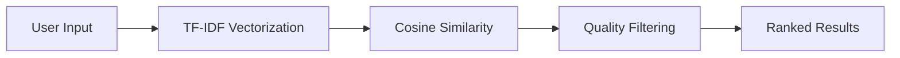

<div align="center">

# 🎬 CineMatch

### AI-Powered Movie Recommendation System

[](https://cinematch-recommender.vercel.app)
&nbsp;&nbsp;&nbsp;
[](https://huggingface.co/spaces/ShariqMukadam/cinematch-backend)

**Intelligent movie recommendations using ML-powered content filtering with 1M+ movies**
</div>

---

## 📸 Preview

<div align="center">
  
  
  <p><i>Smart search with real-time suggestions • Personalized recommendations • Genre filtering</i></p>
</div>

<details>
<summary><b>📱 View Mobile Screenshots</b></summary>
<br/>
  <p align="center" style="display: flex; align-items: flex-start; justify-content: center;">
  
  
</p>
</details>

---

## ⚡ Features

- 🤖 **Content-Based ML Filtering** - TF-IDF vectorization with cosine similarity
- 🔍 **Smart Search** - Real-time autocomplete with debounced API calls
- 🎯 **Multi-Factor Ranking** - Considers ratings, popularity, and vote count
- 🎨 **Fully Responsive** - Seamless experience across mobile, tablet, desktop
- 🚀 **Fast Performance** - <200ms API responses, optimized bundle size
- 🔗 **TMDB Integration** - Direct links to movie details and posters

---

## 🛠️ Tech Stack

**Frontend**
- Next.js 16 (React 19) + TypeScript
- Tailwind CSS
- Deployed on Vercel

**Backend**
- FastAPI (Python)
- scikit-learn (TF-IDF, Cosine Similarity)
- pandas + joblib
- Deployed on Hugging Face Spaces

**Data**
- Full TMDB Movies Dataset 2024 (1M Movies)

---

## 🚀 Quick Start

### Frontend
```bash
git clone https://github.com/IamShariqMukadam/cinematch.git
cd cinematch/frontend
npm install
npm run dev
```

### Backend
```bash
cd cinematch/backend
pip install -r requirements.txt
uvicorn api:app --reload
```

**Environment Variables:**
```bash
# Frontend (.env.local)
NEXT_PUBLIC_API_BASE_URL=your_backend_url

# Backend (.env)
TMDB_API_KEY=your_tmdb_key
```

---

## 🧠 How It Works



1. **Feature Extraction**: Combines movie title, genres, and overview into TF-IDF vectors
2. **Similarity Calculation**: Computes cosine similarity between movie vectors
3. **Smart Ranking**: Filters by rating (7.0+) and vote count (100+), then ranks by popularity
4. **Result Delivery**: Returns top 12 personalized recommendations

---

## 📊 API Endpoints

| Endpoint | Description |
|----------|-------------|
| `GET /recommend?movie={title}` | Get AI recommendations |
| `GET /search?query={term}` | Search movies |
| `GET /genre?genre={name}` | Filter by genre |
| `GET /top-rated` | Top-rated movies |
| `GET /latest` | Latest releases (2025) |

**Try it:**
```bash
curl "https://shariqmukadam-cinematch-backend.hf.space/recommend?movie=inception"
```

---

## 🎯 What I Learned

- Building production-ready ML APIs with FastAPI
- Implementing content-based filtering with scikit-learn
- Creating responsive UIs with Next.js 16 and Tailwind
- Optimizing API performance (caching, debouncing)
- Deploying full-stack ML applications

---

## 🚧 Future Enhancements

- [ ] User authentication & watchlists
- [ ] Collaborative filtering (user-to-user)
- [ ] Movie trailers integration
- [ ] Advanced filters (year, runtime)

---

## 👨‍💻 Author

<h3 align="center">Shariq Mukadam</h3>
<div align="center">
  
[](https://github.com/IamShariqMukadam)
&nbsp;&nbsp;&nbsp;&nbsp;&nbsp;
[](https://www.linkedin.com/in/shariq-mukadam)
&nbsp;&nbsp;&nbsp;&nbsp;&nbsp;
[](https://yourportfolio.com)
&nbsp;&nbsp;&nbsp;&nbsp;&nbsp;
</div>


---

<div align="center">

**⭐ Star this repo if you found it helpful!**


</div>
